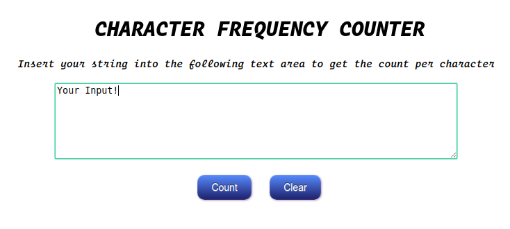
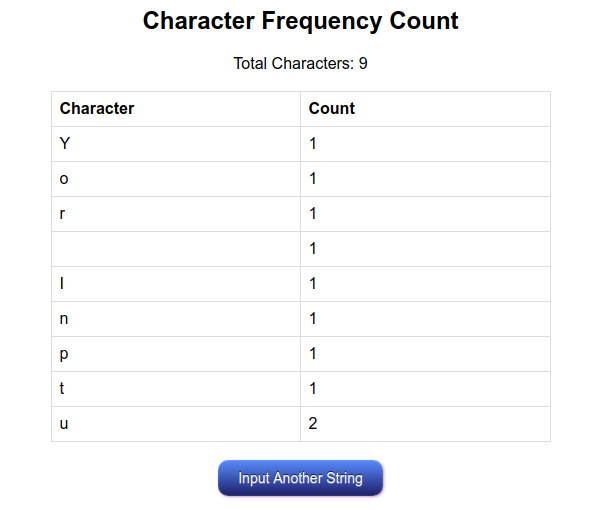
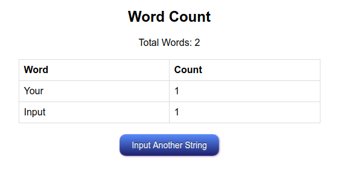

Character Frequency Counter
========================
A php application where you give a string as an input and in return the application finds the occurrence of every character in ascending order as well as the occurrence of words also in ascending order.

Screenshots
========================

Feedback
========================
* Feel free to fork this repo and send a pull request.
* If there are any bugs in the code, by all means let me know.
* Email: humaeedanik@gmail.com